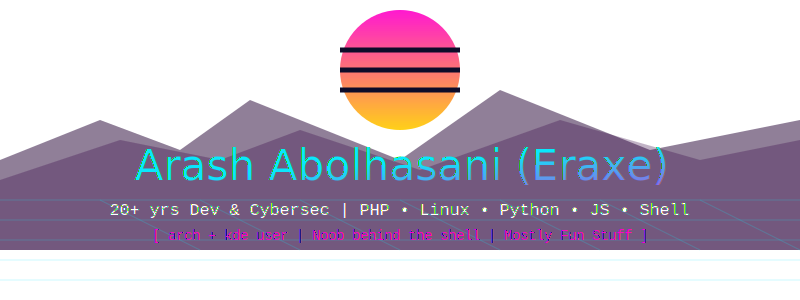

## 👋 About This One...

I mostly work on backend systems, scripts, and turning messy ideas into real, working tools.  
Automation? Love it. Repetitive tasks? Not if I can help it.  
Sometimes I build things the “wrong” way — and they end up working better that way.

---

## 🛠️ What I work with

- **Languages**: Python, JavaScript, PHP, Shell
- **Frameworks**: Django, Angular, REST APIs
- **Dev Tools**: VS Code, IntelliJ, tmux, Git
- **Infra**: Linux, Nginx, LiteSpeed Enterprise, WordPress, WooCommerce

---

## ⚙️ What I care about

- Keeping systems lean, fast, and secure  
- Modular code that’s actually readable  
- UI/UX that feels good (yes, backend people can care too)  
- Small tools that solve real problems  
- Automation that gives me time back  
- Clean code? Sometimes. Clean solutions? Always.

---

💬 Random facts

- Not the most organized coder — and that’s part of the magic  
- I like eye candy in terminal themes and websites alike  
- Half my commits probably started with “wait... what if I just”  
- Most fun: taking weird ideas and making them work

---

## 📦 Projects

I build things that are useful, fun, or both.  
Check out the pinned repos or [explore everything →](https://github.com/eraxe?tab=repositories)

---

## 🧠 Currently into...

`modular tooling` • `low-dependency workflows` • `custom CLIs` • `fun themes` • `clean configs` • `hardening servers` • `building from scratch`

---

## 📫 Reach me

Want to connect or collaborate? Feel free to reach out via issues or email (in profile).

